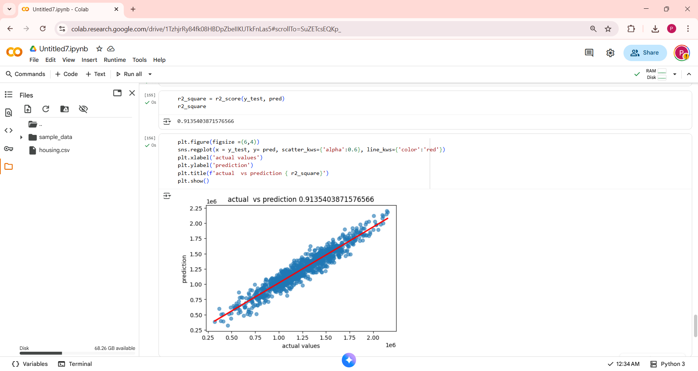

# House-Price-Prediction
Predicting house prices using Linear Regression in Python

# House Price Prediction using Linear Regression 🏡📊

Predicting house prices using Python and Linear Regression. Achieved an R² score of **0.91**, showing strong accuracy in predictions.

## Tools Used
- Python
- Pandas
- NumPy
- Scikit-learn
- Seaborn
- Matplotlib

## Results
 

R² Score: 0.91 ✅

## How to Run
1. Open the `House_Price_Prediction.ipynb` notebook.
2. Run the cells in order to explore data, train the model, and visualize predictions.

## Notebook Link
[Colab Notebook](https://colab.research.google.com/drive/1TzhjrRy84fk08HBDpZbeIIKUTkFnLas5?usp=sharing)

## Hashtags
#MachineLearning #DataScience #Python #LinearRegression #AIProjects
